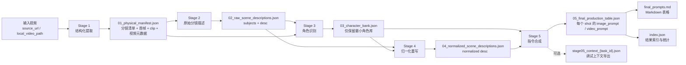

# 现状流程图



说明：

1. Stage 3 现在只做一件事：识别全局角色，并输出最小角色库。
2. `03_character_bank.json` 不再维护状态库、基准状态、相对状态，也不再单独输出 `subject_mappings`。
3. Stage 4 直接把 Stage 2 的 `subjects[].appearance` 和 Stage 3 映射出来的 `ref_id` 融回 `desc`。
4. Stage 4 的核心目标不是“建状态”，而是“把局部主体句子改写成带全局身份的标准句子”。

# 数据结构

## 一致性原则

为了保证后续各 Stage 的数据稳定对齐，约束如下：

1. `scene_id` 始终表示全局唯一分镜编号，从 Stage 1 一直沿用到 Stage 5。
2. `subject_id` 始终表示分镜内局部主体编号，格式固定为 `subject_1`、`subject_2`。
3. `ref_id` 始终表示跨分镜全局角色编号，格式固定为 `Ref_1`、`Ref_2`。
4. Stage 2 的 `desc` 只能引用 `subject_id`，不能直接写 `ref_id`。
5. Stage 3 只输出角色最小公共信息：`ref_id`、`ref_image_path`、`scene_presence`、`canonical_description`。
6. Stage 3 不再输出 `state_id`、`base_state_id`、`base_state`、`states`、`subject_mappings`。
7. Stage 4 的 `desc` 必须使用 `ref_id`，并显式补入该主体在 Stage 2 里的 `appearance`，句式形如 `（appearance）的Ref_1 在地点正在动作`。
8. Stage 4 的文字内容必须能完全从 `02_raw_scene_descriptions.json` 和 `03_character_bank.json` 推导出来，不能额外杜撰。
9. Stage 4 只能把 Stage 2 的 `appearance` 和 Stage 3 的 `ref_id` 注入到 Stage 2 原始句式里，不能改写 Stage 2 `desc` 已确定的地点和动作语义。
10. Stage 5 生成提示词时，角色身份只能来自 `03_character_bank.json`，场景地点和行为只能来自 Stage 4 的标准化 `desc`。

## 后续一致性约束

这个改动之后，后续各 Stage 的事实来源必须强制分层：

1. 身份层：
   `ref_id`、`ref_image_path`、`canonical_description` 只来自 `03_character_bank.json`。
2. 场景主体层：
   `subject_id` 与 `appearance` 只来自 `02_raw_scene_descriptions.json`。
3. 场景语义层：
   原始 `desc` 只来自 `02_raw_scene_descriptions.json`；若后续需要地点和动作，只能在处理过程中基于 `desc` 临时解析，不能作为新的独立事实源长期落盘。
4. 归一化层：
   `04_normalized_scene_descriptions.json` 只能做“appearance 融合 + ref_id 注入 + 文本重写”，不能重新猜测角色，也不能篡改场景动作。
5. 生成层：
   `05_final_production_table.json` 必须以 `04_normalized_scene_descriptions.json` 作为分镜文本事实来源，并以 `03_character_bank.json` 作为身份事实来源，不允许绕回 Stage 2 单独重新认角色。

建议在实现层面额外加 4 条硬校验：

1. Stage 4 对每个 `scene_id + subject_id` 都必须能在 `03_character_bank.json.characters[].scene_presence` 中反查到唯一 `ref_id`，否则报错。
2. 同一个 `scene_id + subject_id` 不能同时出现在两个不同 `ref_id` 的 `scene_presence` 中，否则报错。
3. Stage 4 重写后的 `desc` 必须能逐主体回溯到 `appearance + ref_id + 原始子句`，其中原始子句必须来自 Stage 2 `desc` 的解析结果，否则报错。
4. Stage 5 如果引用了 `desc` 中未出现过的 `ref_id`，或者漏掉了 `desc` 中已出现的 `ref_id`，必须报错。

## Stage 1 输出：`01_physical_manifest.json`

作用：把视频切成可处理的物理分镜资产，作为后续所有阶段的基础输入。

顶层结构：

```json
{
  "project_id": "task_id",
  "video_metadata": {
    "source_url": "原始视频 URL 或本地路径",
    "fps": 30.0,
    "resolution": "1920x1080"
  },
  "scenes": [
    {
      "scene_id": 1,
      "start_time": "00:00:00.000",
      "end_time": "00:00:03.120",
      "keyframe_path": "/abs/path/frame_001.jpg",
      "clip_path": "/abs/path/clip_001.mp4"
    }
  ]
}
```

字段说明：

- `project_id`：任务 ID。
- `video_metadata`：视频元信息。
- `scenes[]`：分镜列表。
- `scene_id`：从 1 开始的分镜编号。
- `start_time` / `end_time`：分镜时间边界。
- `keyframe_path`：该分镜首帧路径。
- `clip_path`：该分镜对应视频片段路径。

## Stage 2 输出：`02_raw_scene_descriptions.json`

作用：保留分镜中的主体列表和原始描述文本，不再保留 `environment`、`camera`。

设计原则：

1. `subjects` 提供后续对齐和归一化所需的最小结构化字段。
2. `desc` 只描述主体、地点、动作，不描述镜头语言。
3. `desc` 中引用的主体必须与 `subjects[].subject_id` 一一对应。
4. Stage 2 对外提供给后续流程的唯一场景语义事实是 `desc`，后续 Stage 不得脱离 `desc` 重新定义地点和动作，也不应在契约中重复落盘新的结构化地点/动作字段。

顶层结构：

```json
{
  "project_id": "task_id",
  "scenes": [
    {
      "scene_id": 1,
      "subjects": [
        {
          "subject_id": "subject_1",
          "appearance": "一名短发年轻女性，穿白色衬衫和深色围裙"
        },
        {
          "subject_id": "subject_2",
          "appearance": "一名戴眼镜的中年男性，穿灰色外套"
        }
      ],
      "desc": "subject_1 在厨房操作台前正在切菜；subject_2 在厨房门口正在看向操作台。"
    }
  ]
}
```

字段说明：

- `subjects[]`：分镜内主体列表。
- `subject_id`：分镜内局部主体编号，只在当前 `scene_id` 范围内有效。
- `appearance`：主体外观描述，用于后续身份对齐与 Stage 4 融句。
- `desc`：场景级原始文字描述，只允许由 `subject_id + 地点 + 动作` 组成。
- Stage 2 不再单独输出 `location`、`action` 字段，后续若需要结构化地点和动作，必须从 `desc` 中解析。

## Stage 3 输出：`03_character_bank.json`

作用：完成身份对齐，只输出最小角色库，不再维护角色状态系统。

设计原则：

1. Stage 3 只回答“这是谁”，不再回答“这个人处于什么状态版本”。
2. 每个全局角色必须有唯一 `ref_id`。
3. 每个角色必须提供一张参考图 `ref_image_path`，供后续提示词与出图使用。
4. 每个角色必须通过 `scene_presence` 记录自己在哪些 `scene_id + subject_id` 中出现过。
5. `canonical_description` 是该角色跨分镜的统一描述，用于帮助下游理解同一角色，不参与 Stage 4 句内重写。
6. Stage 4 所需的 `scene_id + subject_id -> ref_id` 映射，不再独立落盘，而是通过反查 `characters[].scene_presence` 获得。

顶层结构：

```json
{
  "project_id": "task_id",
  "characters": [
    {
      "ref_id": "Ref_1",
      "ref_image_path": "/abs/path/frame_001.jpg",
      "scene_presence": [
        [1, "subject_1"],
        [2, "subject_1"]
      ],
      "canonical_description": "短发年轻女性，穿白色衬衫和深色围裙"
    },
    {
      "ref_id": "Ref_2",
      "ref_image_path": "/abs/path/frame_003.jpg",
      "scene_presence": [
        [1, "subject_2"]
      ],
      "canonical_description": "戴眼镜的中年男性，穿灰色外套"
    }
  ],
  "global_style": "真实摄影风格"
}
```

字段说明：

- `characters[]`：全局角色库。
- `ref_id`：全局角色编号。
- `ref_image_path`：角色参考图。
- `scene_presence`：该角色在哪些分镜、以哪个 `subject_id` 出现过；它同时承担 Stage 4 的反查映射作用。
- `canonical_description`：该角色的统一描述，用于跨分镜理解与后续提示词约束。
- `global_style`：全局风格，可选。

## Stage 4 输出：`04_normalized_scene_descriptions.json`

作用：基于 Stage 2 的原始分镜描述和 Stage 3 的角色映射结果，输出标准化后的分镜描述。

设计原则：

1. `desc` 必须重写，并显式带上原主体的 `appearance` 和映射后的 `ref_id`。
2. 重写后的 `desc` 必须以 `ref_id` 为全局身份锚点，表示它已经完成了从局部主体到全局角色的归一化。
3. Stage 4 可以在处理过程中从 Stage 2 的 `desc` 临时解析地点和动作，但这些解析结果不应作为独立字段落盘。
4. `scenes[]` 中每个 item 只保留 `scene_id` 和 `desc`，不再保留 `subjects` 明细。
5. Stage 4 不使用 `canonical_description` 直接写句子，句内外貌描述优先使用当前分镜的 `subjects[].appearance`，避免把跨分镜汇总描述误写进当前镜头。

顶层结构：

```json
{
  "project_id": "task_id",
  "scenes": [
    {
      "scene_id": 1,
      "desc": "（一名短发年轻女性，穿白色衬衫和深色围裙）的Ref_1 在厨房操作台前正在切菜；（一名戴眼镜的中年男性，穿灰色外套）的Ref_2 在厨房门口正在看向操作台。"
    }
  ]
}
```

字段说明：

- `desc`：归一化后的标准描述，模板固定为 `（appearance）的Ref_x 在地点正在动作`。

清理原则：

1. `04_normalized_scene_descriptions.json` 只保留标准化后的 `desc`。
2. `scenes[]` 中每个 item 只保留 `scene_id` 和 `desc`。
3. 不再落盘 `subjects`、`raw_clause`、`location`、`action` 这类中间结果。
4. 任何地点和动作信息都只能体现在标准化 `desc` 中，避免出现多套语义来源。

归一化重写规则：

1. 保留 Stage 2 的 `subject_id` 与原始 `desc`。
2. 在归一化过程中，可先从 `desc` 中按 `subject_id` 拆出原始子句并临时解析地点与动作。
3. 通过 `scene_id + subject_id` 反查 `03_character_bank.json.characters[].scene_presence`，补出 `ref_id`。
4. 通过 `scene_id + subject_id` 回到 Stage 2 当前分镜的 `subjects[]`，取出对应 `appearance`。
5. 按固定模板把原始子句中的 `subject_id` 替换为 `（appearance）的Ref_id`。
6. 不允许替换动作动词，不允许改写地点短语，不允许注入当前分镜里不存在的外貌信息。
7. 若同一角色在不同分镜的 `appearance` 不同，Stage 4 应使用“当前分镜版本”的 `appearance`，而不是 `canonical_description`。

## Stage 5 输出：`05_final_production_table.json`

作用：基于 `03_character_bank.json` 和 `04_normalized_scene_descriptions.json` 生成最终提示词表。

顶层结构：

```json
{
  "project_id": "task_id",
  "prompts": [
    {
      "shot_id": 1,
      "reference_bindings": [
        {
          "reference_index": 1,
          "ref_id": "Ref_1"
        },
        {
          "reference_index": 2,
          "ref_id": "Ref_2"
        }
      ],
      "image_prompt": "画面提示词",
      "video_prompt": "视频提示词"
    }
  ]
}
```

字段说明：

- `shot_id`：对应 `scene_id`。
- `reference_bindings`：参考图编号与 `ref_id` 的绑定关系。
- `image_prompt`：静态画面提示词。
- `video_prompt`：动态视频提示词。

补充说明：

1. Stage 5 的身份事实来源只能是 `03_character_bank.json.characters[]`。
2. Stage 5 的地点和动作事实来源只能是 `04_normalized_scene_descriptions.json.desc`。
3. Stage 5 不应再回头从 Stage 2 猜角色，也不应绕过 Stage 4 直接使用未归一化文本。
4. Stage 5 若需要角色当前镜头中的外貌，应直接复用 Stage 4 `desc` 里已经融合好的文本，不再重新拼装一遍。

## Few-shot 推演示例：水族馆双角色

作用：验证“Stage 3 只保留最小角色库，Stage 4 直接把 appearance + ref_id 融进 desc”的新约束是否闭环。

示例设定：

1. 角色一是女性，偏胖，紫色长辫子，身穿黄色短袖上衣和黑色运动短裤。
2. 角色二是男性，匀称，上身赤裸，下半身穿着紫色鱼尾装。
3. 分镜 1 里两人同时出现，场景在水族馆主水箱区域。
4. 分镜 2 里两人再次出现，用于验证跨分镜仍能稳定映射到同一 `ref_id`。

### Stage 2 示例：`02_raw_scene_descriptions.json`

说明：

1. `desc` 只写 `subject_id + 地点 + 动作`。
2. 角色外貌全部留在 `subjects[].appearance`。
3. Stage 4 重写时，直接把这里的 `appearance` 融回句子。

```json
{
  "project_id": "task_aquarium_duo",
  "scenes": [
    {
      "scene_id": 1,
      "subjects": [
        {
          "subject_id": "subject_1",
          "appearance": "女性，偏胖，紫色长辫子，身穿黄色短袖上衣和黑色运动短裤"
        },
        {
          "subject_id": "subject_2",
          "appearance": "男性，匀称，上身赤裸，下半身穿着紫色鱼尾装"
        }
      ],
      "desc": "subject_1 在水族箱前双手抬起做出惊讶表情；subject_2 在水族箱内水中挥手。"
    },
    {
      "scene_id": 2,
      "subjects": [
        {
          "subject_id": "subject_1",
          "appearance": "女性，偏胖，紫色长辫子，身穿黄色短袖上衣和黑色运动短裤"
        },
        {
          "subject_id": "subject_2",
          "appearance": "男性，匀称，上身赤裸，下半身穿着紫色鱼尾装"
        }
      ],
      "desc": "subject_1 在水族馆玻璃通道前指向前方；subject_2 在她身旁侧身看向她。"
    }
  ]
}
```

### Stage 3 示例：`03_character_bank.json`

说明：

1. 这里不再有状态，不再有 `subject_mappings`。
2. 只需要保证每个角色有唯一 `ref_id`，并且 `scene_presence` 能反查所有出现位置。
3. `canonical_description` 是跨分镜统一描述，不负责替代当前镜头里的 `appearance`。

```json
{
  "project_id": "task_aquarium_duo",
  "characters": [
    {
      "ref_id": "Ref_1",
      "ref_image_path": "/abs/path/frame_001_subject_1.jpg",
      "scene_presence": [
        [1, "subject_1"],
        [2, "subject_1"]
      ],
      "canonical_description": "女性，偏胖，紫色长辫子，身穿黄色短袖上衣和黑色运动短裤"
    },
    {
      "ref_id": "Ref_2",
      "ref_image_path": "/abs/path/frame_001_subject_2.jpg",
      "scene_presence": [
        [1, "subject_2"],
        [2, "subject_2"]
      ],
      "canonical_description": "男性，匀称，上身赤裸，下半身穿着紫色鱼尾装"
    }
  ],
  "global_style": "真实摄影风格"
}
```

### Stage 4 示例：`04_normalized_scene_descriptions.json`

说明：

1. Stage 4 先通过 `scene_id + subject_id` 反查出 `ref_id`。
2. 然后从当前分镜的 `subjects[]` 里取出 `appearance`。
3. 最后把 `appearance + ref_id` 注入原句，地点和动作保持不动。

```json
{
  "project_id": "task_aquarium_duo",
  "scenes": [
    {
      "scene_id": 1,
      "desc": "（女性，偏胖，紫色长辫子，身穿黄色短袖上衣和黑色运动短裤）的Ref_1 在水族箱前双手抬起做出惊讶表情；（男性，匀称，上身赤裸，下半身穿着紫色鱼尾装）的Ref_2 在水族箱内水中挥手。"
    },
    {
      "scene_id": 2,
      "desc": "（女性，偏胖，紫色长辫子，身穿黄色短袖上衣和黑色运动短裤）的Ref_1 在水族馆玻璃通道前指向前方；（男性，匀称，上身赤裸，下半身穿着紫色鱼尾装）的Ref_2 在她身旁侧身看向她。"
    }
  ]
}
```

### 推演结论

1. Stage 3 已经被压到最小闭环，只负责“跨分镜识别谁是谁”。
2. Stage 4 不再依赖状态系统，直接用当前镜头的 `appearance` 写回句子，因此不会丢掉当镜头可见的外貌细节。
3. `canonical_description` 继续有价值，但它只用于全局角色理解和下游提示词约束，不直接替代 Stage 4 当前句子的 `appearance`。
4. 对实现层来说，核心映射关系已经从 `subject_mappings` 简化为 `characters[].scene_presence` 的反查。

## 衍生产物

### `final_prompts.md`

作用：把最终提示词表渲染成 Markdown 表格，方便人工查看。

典型内容：

```md
| 分镜编号 | 画面提示词 | 视频提示词 |
| --- | --- | --- |
| 1 | ... | ... |
```

### `index.json`

作用：汇总任务结果路径和统计信息。

建议结构：

```json
{
  "project_id": "task_id",
  "contracts": {
    "physical_manifest": "/abs/path/01_physical_manifest.json",
    "raw_scene_descriptions": "/abs/path/02_raw_scene_descriptions.json",
    "character_bank": "/abs/path/03_character_bank.json",
    "normalized_scene_descriptions": "/abs/path/04_normalized_scene_descriptions.json",
    "final_production_table": "/abs/path/05_final_production_table.json"
  },
  "artifacts": {
    "final_prompts.md": "/abs/path/final_prompts.md",
    "index.json": "/abs/path/index.json"
  },
  "stats": {
    "scene_count": 10,
    "character_count": 3,
    "prompt_count": 10
  }
}
```

### `stage05_context_{task_id}.json`（可选）

作用：调试用，记录 Stage 5 的提示词模板、请求体、模型原始输出和最终表，不属于主流程主契约。
